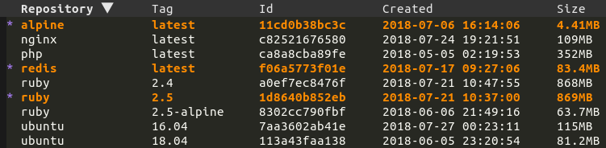
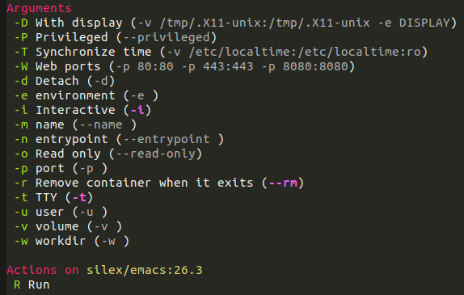

[](http://melpa.org/#/docker)
[](http://stable.melpa.org/#/docker)


# docker.el

Emacs integration for [Docker](https://www.docker.com)!

Supports docker containers, images, volumes, networks and docker-compose.

## Screenshots

### List images



### Image run



## Installation

The recommended way to install docker.el is through [MELPA](https://github.com/milkypostman/melpa).

Here is a example [use-package](https://github.com/jwiegley/use-package) configuration:

``` elisp
(use-package docker
  :ensure t
  :bind ("C-c d" . docker))
```

## Quickstart

Use <kbd>M-x docker</kbd>, select a resource then then mark or unmark items using the following keybindings (for more
marking possibilities, check out https://github.com/politza/tablist):

| Binding            | Description          |
|--------------------|----------------------|
| <kbd>?</kbd>       | List actions         |
| <kbd>l</kbd>       | Configure listing    |
| <kbd>m</kbd>       | Mark item            |
| <kbd>u</kbd>       | Unmark item          |
| <kbd>t</kbd>       | Toggle marks         |
| <kbd>U</kbd>       | Unmark all           |
| <kbd>s</kbd>       | Sort                 |
| <kbd>* r</kbd>     | Mark items by regexp |
| <kbd><</kbd>       | Shrink column        |
| <kbd>></kbd>       | Enlarge column       |
| <kbd>C-c C-e</kbd> | Export to csv        |

Then select an action and follow the instructions.

## Supported commands

- docker container: attach, cp, diff, inspect, kill, logs, pause, rename, restart, rm, start, stop, unpause
- docker image: inspect, pull, push, rm, run, tag
- docker network: rm
- docker volume: rm
- docker-compose: build, config, create, down, exec, logs, pull, push, remove, restart, run, start, stop, up

You can also enter `dired` or open a file inside a container or volume.

## Customizations

Thanks to [transient](https://github.com/magit/transient), all the transients arguments can be set temporarily or
permanently. See https://magit.vc/manual/transient/Saving-Values.html#Saving-Values for more information.

There are also hidden items (e.g on `M-x docker` where you could specify the host or TLS settings), see
https://magit.vc/manual/transient/Enabling-and-Disabling-Suffixes.html for more information.

Here is a list of other customizations you can set:

| Variable                              | Description                                | Default              |
|---------------------------------------|--------------------------------------------|----------------------|
| docker-command                        | The docker binary to use                   | `docker`             |
| docker-compose-command                | The docker-compose binary to use           | `docker-compose`     |
| docker-container-columns              | Columns definition for containers          | `/bin/sh`            |
| docker-container-default-sort-key     | Sort key for containers                    | `("Image")`          |
| docker-container-shell-file-name      | Shell to use when entering containers      | `/bin/sh`            |
| docker-image-columns                  | Columns definition for images              | Too complex to show  |
| docker-image-default-sort-key         | Sort key for images                        | `("Repository")`     |
| docker-image-run-default-args         | Base arguments to use for docker run       | `("-i" "-t" "--rm")` |
| docker-network-columns                | Columns definition for networks            | Too complex to show  |
| docker-network-default-sort-key       | Sort key for networks                      | `("Name")`           |
| docker-pop-to-buffer-action           | Action for `docker-utils-pop-to-buffer`    | `nil`                |
| docker-run-as-root                    | Runs docker as root when enabled           | `nil`                |
| docker-run-async-with-buffer-function | Function used to run programs with buffers | Too complex to show  |
| docker-show-messages                  | If non-nil message docker commands         | `t`                  |
| docker-show-status                    | If non-nil compute status                  | `t`                  |
| docker-volume-columns                 | Columns definition for volumes             | Too complex to show  |
| docker-volume-default-sort-key        | Sort key for volumes                       | `("Driver")`         |

### Changing the default arguments for `docker run`

You can match on the repository name for an image to customize the initial infix arguments via `docker-image-run-custom-args`:

```elisp
(add-to-list
   'docker-image-run-custom-args
   `("^postgres" ("-e POSTGRES_PASSWORD=postgres" . ,docker-image-run-default-args)))
```

So when `docker run` is called on an image whose repository name matches the regular expression `^postgres`, the option
`"-e POSTGRES_PASSWORD=postgres"` will appear as set along with the defaults specified by `docker-image-run-default-args`.

## Vterm support

If [vterm](https://github.com/akermu/emacs-libvterm) is installed, it'll be used for any commands that needs a running
buffer (for example `docker run`, `docker logs`, etc).

## Contributions

They are very welcome, either as suggestions or as pull requests by opening tickets
on the [issue tracker](https://github.com/Silex/docker.el/issues).
