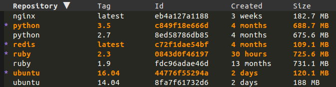

# docker.el

## Installation

The recommended way to install docker.el is through [MELPA](https://github.com/milkypostman/melpa).

Otherwise, simply add the files to your load-path and then `(require 'docker)`.

## Quickstart

Use <kbd>M-x docker-images</kbd>, <kbd>M-x docker-containers</kbd>,
<kbd>M-x docker-volumes</kbd>, <kbd>M-x docker-networks</kbd> or
<kbd>M-x docker-machines</kbd> then mark/unmark items using the
following keybindings:

| Keymap             | Description          |
|--------------------|----------------------|
| <kbd>m</kbd>       | Mark item            |
| <kbd>U</kbd>       | Unmark all           |
| <kbd>u</kbd>       | Unmark item          |
| <kbd>t</kbd>       | Toggle marks         |
| <kbd>s</kbd>       | Sort                 |
| <kbd><</kbd>       | Shrink column        |
| <kbd>></kbd>       | Enlarge column       |
| <kbd>C-c C-e</kbd> | Export to csv        |
| <kbd>* r</kbd>     | Mark items by regexp |

Press `?` to known about available keybindings in order to run actions
on these items. Also check out https://github.com/politza/tablist to find more
about the marking possibilities.

You can also call the [API](#api) directly.

## Configuration

### OSX / docker-machine

The following configuration is required (some of it can probably be
simplified by using https://github.com/purcell/exec-path-from-shell).

``` elisp
(setenv "PATH" (concat (getenv "PATH") ":/usr/local/bin"))
(setq exec-path (append exec-path '("/usr/local/bin")))
;; Use "docker-machine env box" command to find out your environment variables
(setenv "DOCKER_TLS_VERIFY" "1")
(setenv "DOCKER_HOST" "tcp://10.11.12.13:2376")
(setenv "DOCKER_CERT_PATH" "/Users/foo/.docker/machine/machines/box")
(setenv "DOCKER_MACHINE_NAME" "box")
```

## Screenshots

### images



## Commands

### docker-global-mode

Running <kbd>M-x docker-global-mode</kbd> creates keybindings to the
various docker api. The keymap prefix is `C-c d` by default and can be
changed with <kbd>M-x customize-variable docker-keymap-prefix</kbd>.

### API

| command                      | keymap               | description                                                     |
|------------------------------|----------------------|-----------------------------------------------------------------|
| docker-images                | <kbd>C-c d i i</kbd> | list images                                                     |
| docker-rmi                   | <kbd>C-c d i d</kbd> | delete image                                                    |
| docker-pull                  | <kbd>C-c d i f</kbd> | pull image                                                      |
| docker-push                  | <kbd>C-c d i p</kbd> | push image                                                      |
| docker-run                   | <kbd>C-c d i r</kbd> | run image                                                       |
| docker-containers            | <kbd>C-c d c c</kbd> | list containers                                                 |
| docker-rm                    | <kbd>C-c d c d</kbd> | delete container                                                |
| docker-stop                  | <kbd>C-c d c o</kbd> | stop container                                                  |
| docker-pause                 | <kbd>C-c d c p</kbd> | pause container                                                 |
| docker-restart               | <kbd>C-c d c r</kbd> | restart container                                               |
| docker-start                 | <kbd>C-c d c s</kbd> | start container                                                 |
| docker-unpause               | <kbd>C-c d c u</kbd> | unpause container                                               |
| docker-volumes               | <kbd>C-c d v v</kbd> | list volumes                                                    |
| docker-volume-rm             | <kbd>C-c d v d</kbd> | delete volume                                                   |
| docker-networks              | <kbd>C-c d n n</kbd> | list networks                                                   |
| docker-network-rm            | <kbd>C-c d n d</kbd> | delete network                                                  |
| dockerfile-build-buffer      | <kbd>C-c d B</kbd>   | Build [Dockerfile](https://github.com/spotify/dockerfile-mode)  |

### docker-images

<kbd>M-x docker-images</kbd> lists the docker images.
After having selected some images, you can do the following actions:

- `F`: pull
- `P`: push
- `D`: rmi
- `R`: run

### docker-containers

Running <kbd>M-x docker-containers</kbd> lists the docker containers.
After having selected some containers, you can do the following actions:

* `S`: start
* `O`: stop
* `R`: restart
* `P`: pause/unpause
* `I`: inspect
* `L`: logs
* `C`: cp
* `D`: rm
* `d`: diff

### docker-volumes

Running <kbd>M-x docker-volumes</kbd> lists the docker volumes.
After having selected some volumes, you can do the following actions:

* `D`: rm

### docker-networks

Running <kbd>M-x docker-networks</kbd> lists the docker networks.
After having selected some networks, you can do the following actions:

* `D`: rm

### docker-machine-ls

Running <kbd>M-x docker-machine-ls</kbd> lists the docker machines.
After having selected some machines, you can do the following actions:

* `S`: start
* `E`: env
* `O`: stop
* `R`: restart
* `D`: rm

## Philosophy

This package is inspired by packages like:

- `dired` / `ibuffer` for selecting images / containers to operate on.
- [magit](https://github.com/magit/magit) for the various actions popups.
- [projectile](https://github.com/bbatsov/projectile) for the keymap.

## Contributions welcome!

Either as suggestions or as pull requests by opening tickets on the
[issue tracker](https://github.com/Silex/docker.el/issues).
