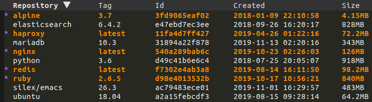

[](http://melpa.org/#/docker)
[](http://stable.melpa.org/#/docker)

# docker.el

Emacs integration for [Docker](https://www.docker.com)!

Supports docker containers, images, volumes, networks, docker-machine and docker-compose.

## Screenshots

### List images



### Image run popup


## Installation

The recommended way to install docker.el is through [MELPA](https://github.com/milkypostman/melpa).

Here is a example [use-package](https://github.com/jwiegley/use-package) configuration:

``` elisp
(use-package docker
  :ensure t
  :bind ("C-c d" . docker))
```

## Quickstart

Use <kbd>M-x docker</kbd>, select a resource then then mark or unmark items using the following keybindings (for more
marking possibilities, check out https://github.com/politza/tablist):

| Binding            | Description          |
|--------------------|----------------------|
| <kbd>?</kbd>       | List actions         |
| <kbd>l</kbd>       | Configure listing    |
| <kbd>m</kbd>       | Mark item            |
| <kbd>u</kbd>       | Unmark item          |
| <kbd>t</kbd>       | Toggle marks         |
| <kbd>U</kbd>       | Unmark all           |
| <kbd>s</kbd>       | Sort                 |
| <kbd>* r</kbd>     | Mark items by regexp |
| <kbd><</kbd>       | Shrink column        |
| <kbd>></kbd>       | Enlarge column       |
| <kbd>C-c C-e</kbd> | Export to csv        |

Then select an action and follow the popup instructions.

## Supported commands

- docker container: attach, cp, diff, inspect, kill, logs, pause, rename, restart, rm, start, stop, unpause
- docker image: inspect, pull, push, rm, run, tag
- docker network: rm
- docker volume: rm
- docker-machine: create, env, restart, rm, start, stop
- docker-compose: build, create, down, exec, logs, pull, push, remove, restart, run, start, stop, up

You can also enter `dired` or open a file inside a container or volume.

## Customizations

### Popups

Thanks to [magit-popup](https://github.com/magit/magit-popup), all the popups default arguments can be customized. For
example, here is how to customize the arguments for `docker-image-run-popup`:

``` elisp
(setq docker-image-run-arguments '("-i" "-t" "--rm"))
```

or inside a use-package declaration:

``` elisp
(use-package docker
  :ensure t
  :bind ("C-c d" . docker)
  :custom (docker-image-run-arguments '("-i" "-t" "--rm")))
```

You can also customize these using <kbd>M-x customize-variable</kbd>.

### Others

| Variable                          | Description                                                              | Default          |
|-----------------------------------|--------------------------------------------------------------------------|------------------|
| docker-command                    | The docker binary to use ([podman](https://podman.io) is also supported) | `docker`         |
| docker-container-default-sort-key | Sort key for docker containers                                           | `("Image")`      |
| docker-container-shell-file-name  | Shell to use when entering containers                                    | `/bin/bash`      |
| docker-image-default-sort-key     | Sort key for docker images                                               | `("Repository")` |
| docker-machine-default-sort-key   | Sort key for docker machines                                             | `("Name")`       |
| docker-network-default-sort-key   | Sort key for docker networks                                             | `("Name")`       |
| docker-run-as-root                | Run docker as root                                                       | `nil`            |
| docker-volume-default-sort-key    | Sort key for docker volumes                                              | `("Driver")`     |

## FAQ

### How to use docker-machine under OSX?

The following configuration is required (some of it can probably be simplified by using
https://github.com/purcell/exec-path-from-shell).

``` elisp
(setenv "PATH" (concat (getenv "PATH") ":/usr/local/bin"))
(setq exec-path (append exec-path '("/usr/local/bin")))
;; Use "docker-machine env box" command to find out your environment variables
(setenv "DOCKER_TLS_VERIFY" "1")
(setenv "DOCKER_HOST" "tcp://10.11.12.13:2376")
(setenv "DOCKER_CERT_PATH" "/Users/foo/.docker/machine/machines/box")
(setenv "DOCKER_MACHINE_NAME" "box")
```

## Contributions

They are very welcome, either as suggestions or as pull requests by opening tickets
on the [issue tracker](https://github.com/Silex/docker.el/issues).
